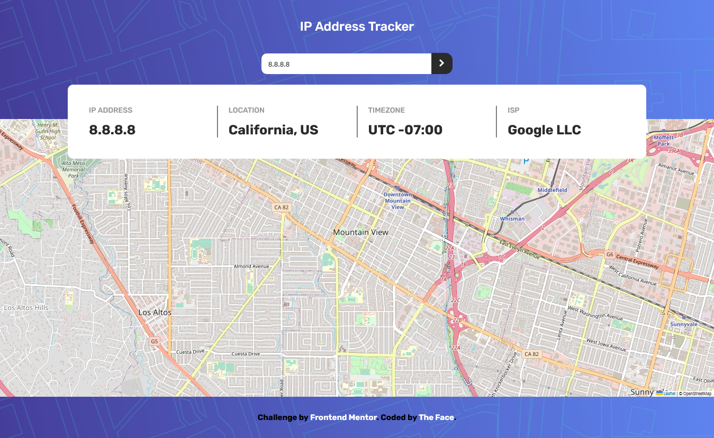

# Frontend Mentor - IP address tracker solution

This is my solution to the [IP address tracker challenge on Frontend Mentor](https://www.frontendmentor.io/challenges/ip-address-tracker-I8-0yYAH0).

### Screenshot

### Links

- Solution URL: [Check solution](https://www.frontendmentor.io/solutions/ip-address-tracker-koNTA8H-o6)
- Live Site URL: [Visit live site](https://thefaceiptracker.vercel.app)

### Built with

- Semantic HTML5 markup
- CSS custom properties
- JavaScript

## Author

- Portfolio - [Ezekiel The Face](https://thefaccodes.web.app)
- Frontend Mentor - [@thefacecodes](https://www.frontendmentor.io/profile/thefacecodes)
- Twitter - [@thefacecodes](https://www.twitter.com/thefacecodes)
